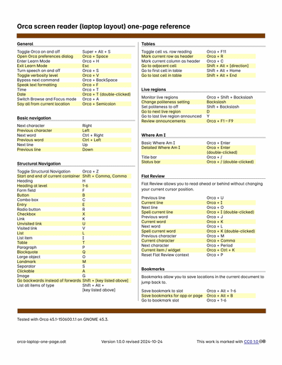

# Orca screen reader (laptop layout) one-page reference
[Orca](https://orca.gnome.org) is screen reader software made by GNOME that ships with several Linux distributions, such as Fedora, Ubuntu, and OpenSUSE. 

This document aims to be a one-page reference of keyboard commands for Orca. It's generally intended for sighted users to print out and look at while learning how to use Orca. But of course anyone is free to use it if it seems helpful. 

## Dependencies
- [Inter](https://fonts.google.com/specimen/Inter) font
- Word processing software that can read ODT files, such as LibreOffice

## Changelog
### 2024-10-24 version 1.0.0
Initial version