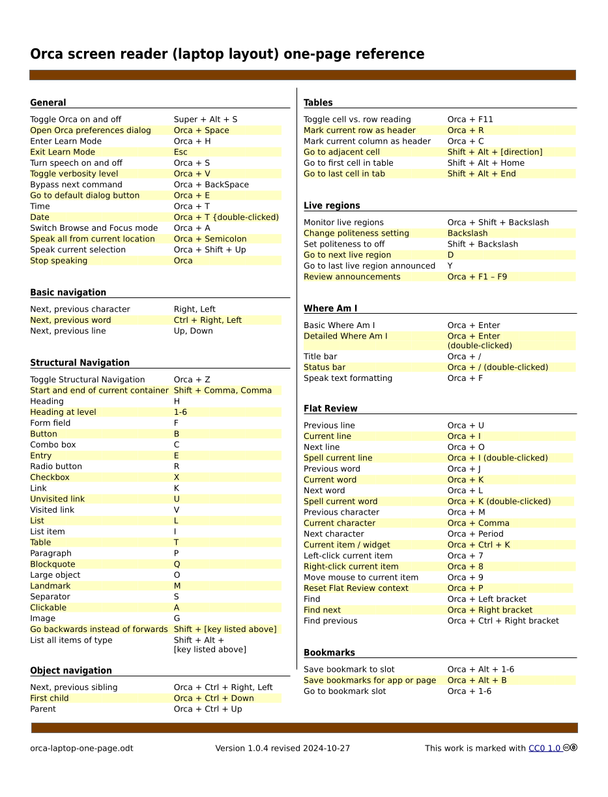

# Orca screen reader (laptop layout) one-page reference
[Orca](https://orca.gnome.org) is screen reader software made by GNOME that ships with several Linux distributions, such as Fedora, Ubuntu, and OpenSUSE. 

This document aims to be a one-page reference sheet of keyboard commands for Orca. It's a work in progress that may be improved by removing little-used commands and adding missing commands. 

This document is not produced by, endorsed by, or in any other way associated with GNOME, the maintainers of Orca. 

## Dependencies
- [Inter](https://fonts.google.com/specimen/Inter) font
- Word processing software that can read ODT files, such as LibreOffice

## Changelog
### 2024-10-24 version 1.0.0
Initial version
